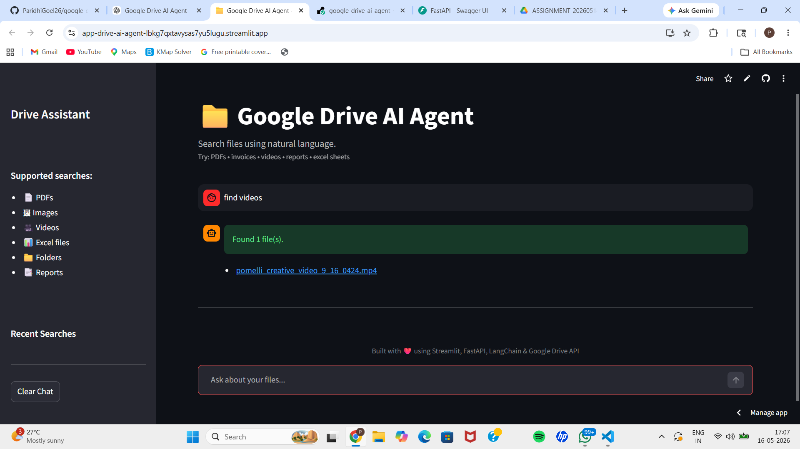

# 📁 Google Drive AI Agent

AI-powered Google Drive search assistant built using FastAPI, Streamlit, LangGraph, LangChain, and Google Drive API.

---

## 🚀 Live Demo

https://app-drive-ai-agent-lbkg7qxtavysas7yu5lugu.streamlit.app/

---

## ✨ Features

- 🔍 Search Google Drive using natural language
- 📄 Find PDFs
- 🖼 Find Images
- 🎥 Find Videos
- 📊 Find Excel Files
- 📁 Find Folders
- 📑 Find Reports
- 🤖 AI-generated Drive queries
- ⚡ FastAPI Backend
- 🎨 Streamlit Frontend

---

## 🛠 Tech Stack

### Frontend
- Streamlit

### Backend
- FastAPI
- LangGraph
- LangChain

### APIs
- Google Drive API
- Groq API

### Deployment
- Render
- Streamlit Cloud

---

## 📂 Project Structure

```bash
google-drive-ai-agent/
│
├── backend/
│   ├── app/
│   │   ├── agents/
│   │   ├── routes/
│   │   ├── services/
│   │   ├── models/
│   │   └── main.py
│   │
│   └── requirements.txt
│
├── frontend/
│   ├── app.py
│   └── requirements.txt
│
└── README.md
```

---

## ⚙️ Setup Instructions

### 1️⃣ Clone Repository

```bash
git clone https://github.com/ParidhiGoel26/google-drive-ai-agent.git

cd google-drive-ai-agent
```

---

### 2️⃣ Create Virtual Environment

```bash
python -m venv .venv
```

---

### 3️⃣ Activate Environment

#### Windows

```bash
.venv\Scripts\activate
```

#### Mac/Linux

```bash
source .venv/bin/activate
```

---

### 4️⃣ Install Dependencies

```bash
pip install -r requirements.txt
```

---

## 🔑 Environment Variables

Create a `.env` file inside backend folder.

```env
GOOGLE_DRIVE_FOLDER_ID=your_folder_id

GOOGLE_SERVICE_ACCOUNT_JSON=your_service_account_json

GROQ_API_KEY=your_groq_api_key
```

---

## ▶️ Run Backend

```bash
uvicorn app.main:app --reload
```

Backend URL:

```bash
http://127.0.0.1:8000
```

Swagger Docs:

```bash
http://127.0.0.1:8000/docs
```

---

## 🎨 Run Frontend

```bash
streamlit run app.py
```

---

## 📸 Output Screenshot



---

## 🔍 Example Queries

```text
find pdfs

find videos

find images

find folders

find reports

find excel sheets
```

---

## ☁️ Deployment

### Backend
- Render

### Frontend
- Streamlit Cloud

---

## 🔐 Google Drive API Setup

1. Create Google Cloud Project
2. Enable Google Drive API
3. Create Service Account
4. Download JSON credentials
5. Share Drive Folder with service account email

---

## 👩‍💻 Author

### Paridhi Goel

GitHub:
https://github.com/ParidhiGoel26

---

## ⭐ Project Status

✅ Completed and Fully Working
